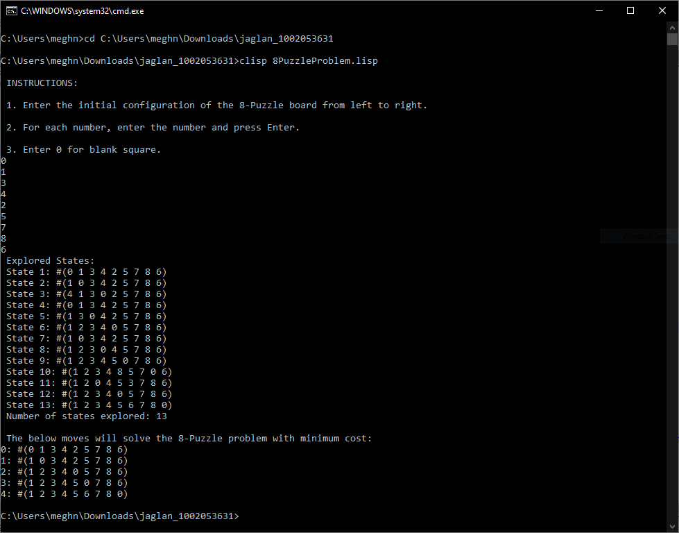

### PROBLEM: 8-Puzzle Problem

#### Problem Description

For the initial configuration of the board find a solution.

**Variables**: number of squares each having a number from 1
to 8 and one square which is empty

**Domain**: a board of 3x3 size

**Constraints**: when moving a tile up, down, left or right:

1.  there's no other tile blocking you in the direction of the movement

2.  you're not trying to move outside of the boundaries/edges.

Initial State: \[\[0,1,3\]\[4,2,5\]\[7,8,6\]\] ; 0 denotes the empty
square

Goal State: \[\[1,2,3\]\[4,5,6\]\[7,8,0\]\] ; 0 denotes the empty square

Heuristic Function: number of misplaced tiles

Path Cost: depth in the tree

#### Implementation

Implementing 8-Puzzle problem using A\* algorithm. A\* algorithm is best
first, informed graph search algorithm. It uses both a heuristic
function h(n) and the path cost to the node g(n) in computing the cost
f(n)=h(n)+g(n)

For the 8-puzzle problem, we are defining the f(n) as below:

f(n) = h(n) + g(n)

where, h(n) is the number of misplaced tiles

g(n) is the depth of a node in the search tree

Implementation Explanation:

 -  We first determine the given board configuration is a solvable or not by counting the number of inversions. If there are odd number of inversions, it means the problem is not solvable.

 -  We then proceed to solve the problem if it is feasible.

    a.  For the root node, we determine the heuristic cost and add it to the search tree.

    b.  We determine the next possible moves available from the root node based on the position of empty square.\
    For each move available to the parent node       
	 - We determine the heuristic cost and the path cost, and add it in
   the search tree if that board configuration is not in the tree.
	 - We order each board based on the f cost and return the board configuration with least f cost

    c.  We keep looking for the next possible move till the board configuration returned is the same as the goal state.

**Result/Output:**

Feasible Problem:

**Bugs/Deficiencies:**

Not able to determine infeasible board configuration using inversion
count.
