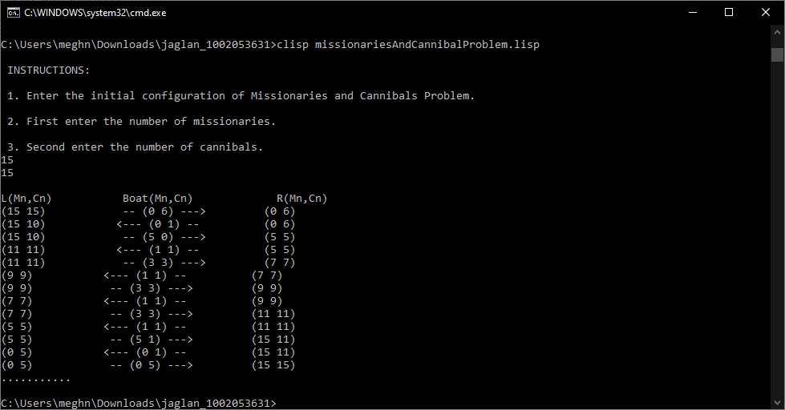
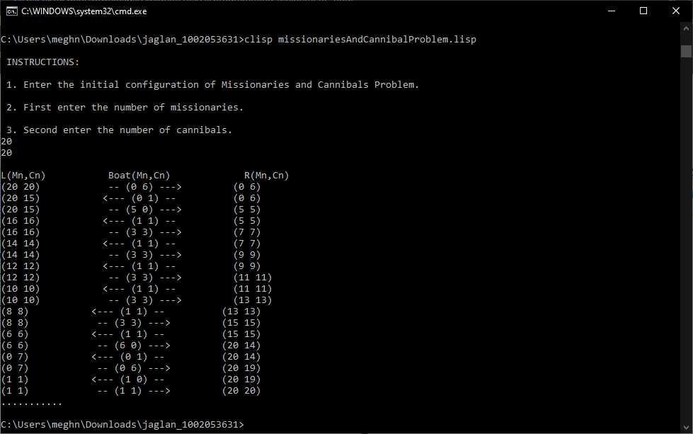

### PROBLEM: Missionaries and Cannibals

#### Problem Description

For a group of missionaries and cannibals to cross a river:

**Variables**: the number of missionaries and cannibals on the
left side of the river, on the boat, and on the right side of the river.
We can represent it as

> \[L(M~n~, C~n~), B(M~n~, C~n~), R(M~n~, C~n~)\]

where, 
		L(M~n~, C~n~) is the number of missionaries and cannibals on the
left side of the river,
		B(M~n~, C~n~) is the number of missionaries and cannibals on the boat,
		R(M~n~, C~n~) is the number of missionaries and cannibals on the right
side of the river.

**Constraints**: Following are the constraints that the
configuration of the number of missionaries and cannibals must adhere to
when crossing the river:

1.  M~n~ \>= C~n~

2.  For B(M~n~, C~n~), M~n~ + C~n~ \<= 6

3.  Total M~n~ and C~n~ are both greater than 0

Initial State: \[L(15, 15), B(0, 0), R(0, 0)\]

Goal State: \[L(0, 0), B(0, 0), R(15, 15)\]

Path Cost: 1 unit per crossing

#### Implementation

The given missionaries and cannibals problem is implemented using Greedy
Best First Search. Greedy Best First Search expands the node that has
the best heuristic value.

For the missionaries and cannibals problem, we are defining the f(n) as
below:

f(n) = h(n)

where, h(n) is $\frac{M_{n} + C_{n}}{boat\ capacity}$

**Result/Output:**

For 15 cannibals and 15 missionaries:

For 20 cannibals and 20 missionaries:

**Bugs/Deficiencies:**

The code is implemented for a fixed boat capacity of 6.
