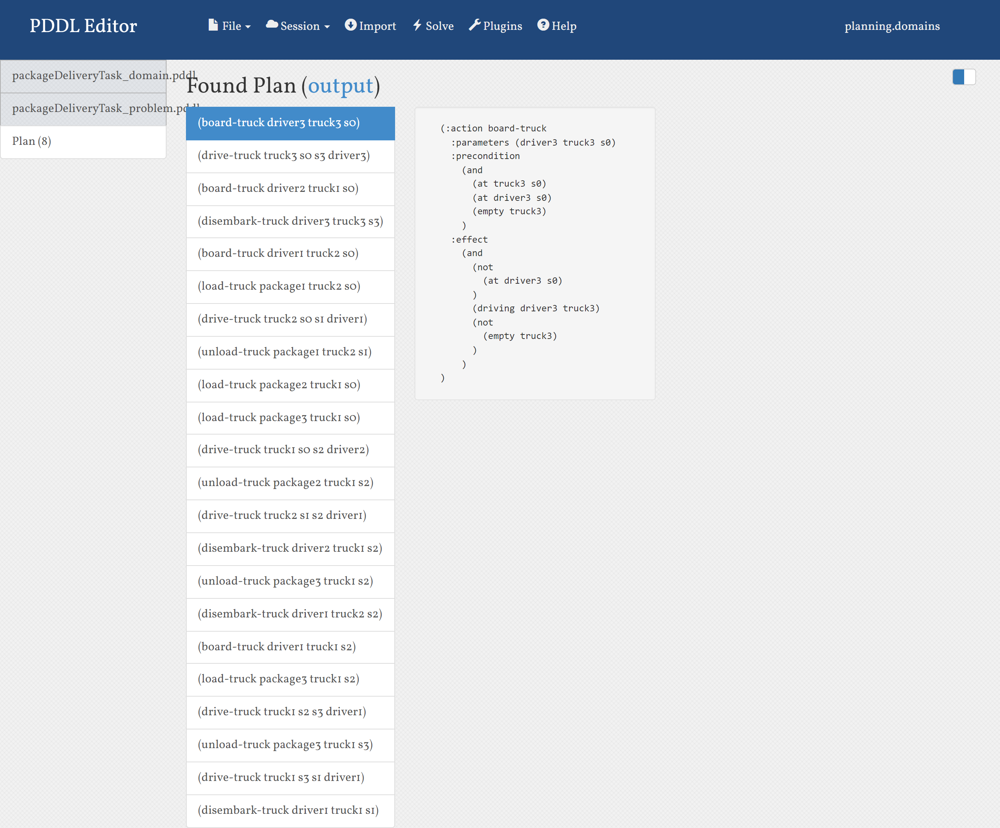

### PROBLEM: Package Delivery Task

#### Problem Description

There is a set of drivers, trucks, packages, and locations for this problem. The goal is to deliver the packages to the locations while minimizing the amount of time and fuel used.

#### Implementation

For this problem, the problem PDDL was modified to include driver3, truck3, package3, and s3.

All the drivers, trucks, and packages were initialized to be at location s0.

The goal state has been modified as below:

- driver1, truck1, package1 at location s1
- driver2, truck2, package2 at location s2
- driver3, truck3, package3 at location s3

Additionally, the links between locations were modified as per the below:

**Bugs/Deficiencies:**

The current implementation supports only 3 drivers, 3 locations for package delivery, and 3 packages are defined. If we want to add more drivers/packages or want to support more locations, we will need to modify the problem code.

**Output:**

