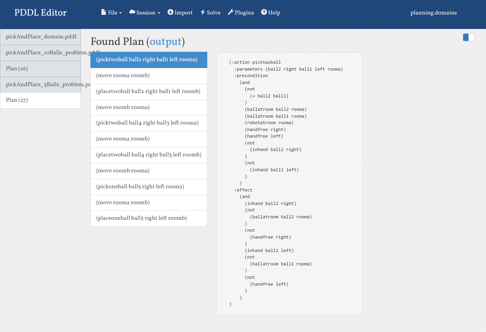
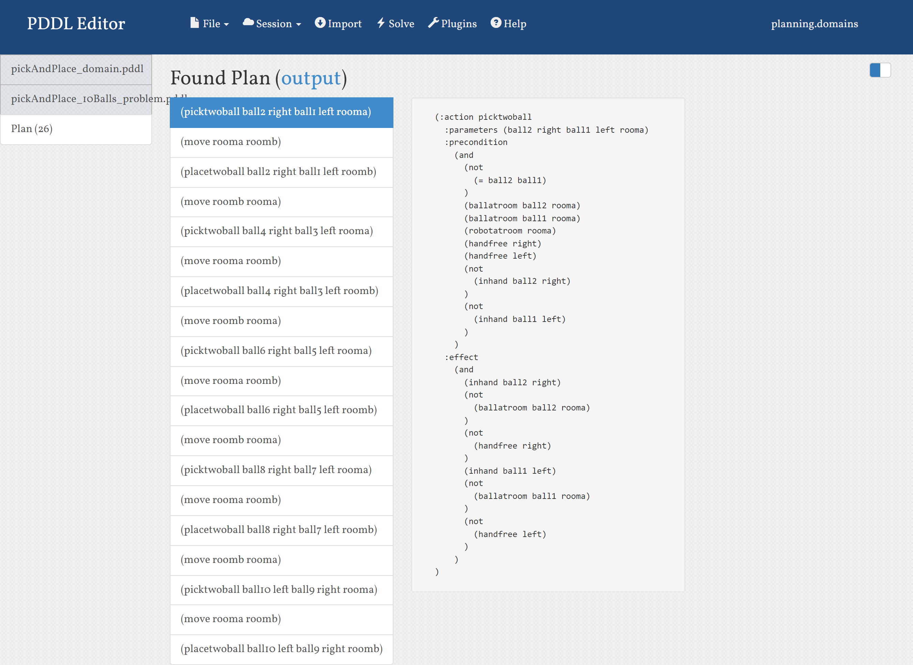

### PROBLEM: Pick and Place Task

#### Problem Description

There is a robot that can move between two rooms and pick or place balls with either of its two arms. Initially, the robot and all the balls are in the first room. We want the robot to pick the balls from the first room and place them in the second room.

#### Implementation

The problem PDDL includes the information about following objects:

- Two rooms - rooma, roomb.
- Balls. 10 balls has been defined for 10 ball problem and 5 balls have been defined for 5 ball problem.
- Robot arms - left, right.
- All the balls are initially placed in room 'rooma'.
- The goal is defined as the location of all the balls should be room 'roomb'.

In the domain PDDL, five actions have been defined:

- pickOneBall
- pickTwoBall
- placeOneBall
- placeTwoBall
- move

'move' action moves the robot from room 'rooma' to 'roomb' or 'roomb' to 'rooma'.

'pickOneBall' and 'pickTwoBall' action picks the number of balls in the room as per the action planned. Both the actions have the precondition that the robots arm should be free. Additionally, for picking two balls, both balls should be different.

'placeOneBall' and 'placeTwoBall' action places the ball(s) in the room. It checks whether the robot is in the correct room and the ball(s) to be placed are in the robot's hand.

**Output:**

Moving 5 Balls:

Moving 10 Balls:

**Bugs/Deficiencies:**

The limitation of this domain is that the robot can only pick a maximum of two balls.